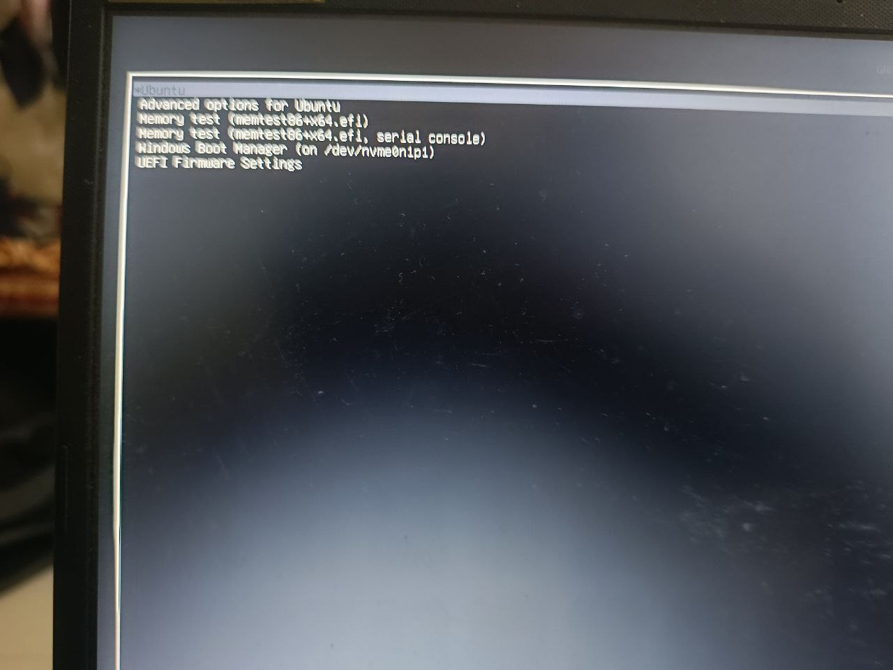

# ubuntu-dual-boot-setup
# Ubuntu Dual Boot Installation Guide

## Overview
This guide outlines the steps I followed to set up a dual boot environment with Ubuntu and Windows on my laptop.

## Prerequisites
- A USB drive (at least 8GB)
- Ubuntu ISO file
- Backup of important data
- Access to BIOS/UEFI settings

## Steps to Install Ubuntu Alongside Windows

### 1. **Download Ubuntu ISO**
   - Visit [Ubuntu Downloads](https://ubuntu.com/download/desktop) and download the latest version of Ubuntu.

### 2. **Create a Bootable USB Drive**
   - Use [Rufus](https://rufus.ie/) (for Windows) or `dd` command (for Linux) to create a bootable USB drive with the Ubuntu ISO.

### 3. **Prepare for Installation**
   - Backup all important data from your existing OS.
   - Ensure you have sufficient free space on your hard drive for Ubuntu.

### 4. **Boot from the USB Drive**
   - Restart your computer and enter the BIOS/UEFI settings (usually by pressing `F2`, `F12`, `Esc`, or `Del`).
   - Change the boot order to prioritize the USB drive.
   - Save and exit BIOS/UEFI.

### 5. **Start Ubuntu Installation**
   - Select “Install Ubuntu” from the boot menu.
   - Choose your language and keyboard layout.

### 6. **Select Installation Type**
   - Choose “Install Ubuntu alongside Windows” (or another option as needed).

### 7. **Partitioning**
   - The installer will automatically allocate space for Ubuntu. Review the partitioning layout and adjust if necessary.

### 8. **Set Up User Account**
   - Enter your name, computer name, username, and password.

### 9. **Complete Installation**
   - Follow the prompts to complete the installation.
   - Once finished, remove the USB drive and restart your computer.

### 10. **Verify Dual Boot**
   - Upon restart, you should see the GRUB boot menu allowing you to choose between Ubuntu and Windows.

## Notes
- Ensure your system is connected to power during installation to avoid interruptions.
- Refer to Ubuntu’s official documentation or community forums for additional help if needed.

## Screenshots

### GRUB Boot Menu
The GRUB boot menu allows you to select between Ubuntu and Windows:
![GRUB Menu]

